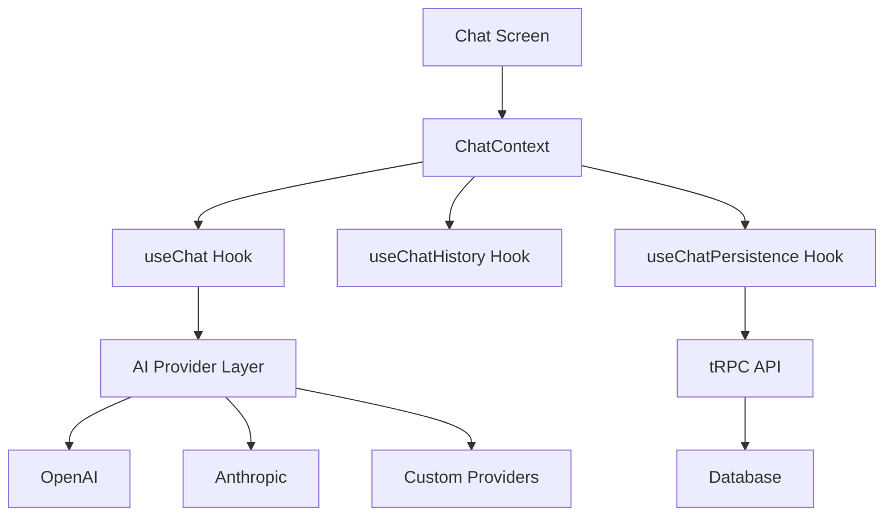

<Frame>
  
</Frame>

## Overview

Launch includes a production-ready AI chat feature that supports multiple AI providers out of the box. The implementation follows a modular architecture that makes it easy to extend with new providers, customize system prompts, and build sophisticated AI-powered features.

## Key Features

<Columns cols={2}>
  <Card title="Multi-Provider Support" icon="brain">
    Switch between OpenAI, Anthropic, and other providers with a unified
    interface.
  </Card>
  <Card title="Streaming Responses" icon="bolt">
    Real-time streaming for a responsive chat experience with stop generation
    support.
  </Card>
  <Card title="System Prompts" icon="wand-magic-sparkles">
    Predefined personas and custom system prompts to shape AI behavior.
  </Card>
  <Card title="Chat Persistence" icon="database">
    Full conversation history stored in your database with seamless sync.
  </Card>
</Columns>

## Architecture

The AI feature is built with extensibility in mind, separating concerns into distinct layers.



### Core Components

<Card title="AI Provider Abstraction" icon="layer-group">
  **Location**: `lib/ai/providers/` A unified interface for working with
  different AI providers. Each provider implements the same interface, making it
  easy to add new ones.
</Card>

<Card title="Custom Hooks" icon="code">
  **Location**: `features/chat/hooks/` Business logic extracted into reusable
  hooks: `useChat` for messaging, `useChatHistory` for history management, and
  `useChatPersistence` for database sync.
</Card>

<Card title="Chat Context" icon="share-nodes">
  **Location**: `features/chat/context/` Global state management for chat
  functionality, reducing prop drilling and simplifying component interactions.
</Card>

## Supported Providers

### OpenAI

```typescript
// Available models
- gpt-4o          // Latest multimodal model
- gpt-4           // Most capable reasoning model
- gpt-3.5-turbo   // Fast and cost-effective
```

### Anthropic

```typescript
// Available models
-claude -
  3 -
  5 -
  sonnet - // Best balance of speed and capability
  claude -
  3 -
  opus; // Most powerful for complex tasks
```

## Quick Start

### 1. Configure Your API Keys

Add your API keys to the backend environment:

```bash
# OpenAI
OPENAI_API_KEY=sk-...

# Anthropic (optional)
ANTHROPIC_API_KEY=sk-ant-...
```

### 2. Using the Chat Screen

The chat screen is available at `/ai-chat` and includes:

- Model selector dropdown
- Prompt suggestion cards
- Real-time streaming responses
- Chat history via bottom sheet
- New chat functionality

### 3. Customizing System Prompts

System prompts define the AI's persona and behavior. They're configured in `lib/ai/prompts/index.ts`:

```typescript
export const systemPrompts = {
  staffEngineerMentor: {
    id: "staff-engineer-mentor",
    name: "Staff Engineer Mentor",
    description: "A senior mentor who teaches through the Socratic method",
    prompt: `You are a senior staff software engineer with 20+ years...`,
  },
  codingAssistant: {
    id: "coding-assistant",
    name: "Coding Assistant",
    description: "A helpful coding assistant",
    prompt: `You are a helpful coding assistant...`,
  },
};
```

## Usage Examples

### Basic Chat Integration

```typescript
import { ChatProvider, useChatContext } from "@/features/chat";

function App() {
  return (
    <ChatProvider>
      <ChatScreen />
    </ChatProvider>
  );
}

function ChatScreen() {
  const { messages, sendMessage, isStreaming } = useChatContext();

  return (
    <View>
      {messages.map((msg) => (
        <ChatBubble key={msg.id} message={msg} />
      ))}
      <Input onSubmit={sendMessage} disabled={isStreaming} />
    </View>
  );
}
```

### Switching Models

```typescript
const { setModel, currentModel } = useChatContext();

// Switch to a different model
setModel("claude-3-5-sonnet");
```

### Using System Prompts

```typescript
import { getSystemPrompt } from "@/lib/ai";

const { setSystemPrompt } = useChatContext();

// Set a predefined persona
const mentorPrompt = getSystemPrompt("staff-engineer-mentor");
setSystemPrompt(mentorPrompt.prompt);
```

## UI Components

### Model Selector

A dropdown component for selecting AI models with provider grouping:

```typescript
<ModelSelect
  value={selectedModel}
  onValueChange={setSelectedModel}
/>
```

### Prompt Suggestions

Contextual prompt cards that adapt to the current system prompt:

```typescript
<PromptSuggestions
  onSelect={handlePromptSelect}
  maxWidth={inputWidth}
/>
```

### Chat History Sheet

A bottom sheet displaying conversation history:

```typescript
<ChatHistorySheet
  isOpen={showHistory}
  onClose={() => setShowHistory(false)}
  onSelectChat={loadChat}
/>
```

## Database Schema

Conversations are persisted using the following schema:

```prisma
model Chat {
  id           String        @id @default(cuid())
  userId       String
  title        String        @db.VarChar(255)
  model        String        @default("gpt-4")
  systemPrompt String?       @db.Text
  createdAt    DateTime      @default(now())
  updatedAt    DateTime      @updatedAt

  user         User          @relation(fields: [userId], references: [id])
  messages     ChatMessage[]
}

model ChatMessage {
  id        String   @id @default(cuid())
  chatId    String
  role      String   @db.VarChar(20)
  content   String   @db.Text
  createdAt DateTime @default(now())

  chat      Chat     @relation(fields: [chatId], references: [id])
}
```

## API Endpoints

The chat feature exposes the following tRPC procedures:

| Procedure          | Type     | Description                        |
| ------------------ | -------- | ---------------------------------- |
| `chat.list`        | Query    | Get all chats for the current user |
| `chat.get`         | Query    | Get a specific chat with messages  |
| `chat.create`      | Mutation | Create a new chat                  |
| `chat.delete`      | Mutation | Delete a chat                      |
| `chat.addMessage`  | Mutation | Add a message to a chat            |
| `chat.updateTitle` | Mutation | Update chat title                  |

## Next Steps

<Columns cols={2}>
  <Card title="Extending Providers" icon="plug" href="/ai-features/providers">
    Learn how to add custom AI providers.
  </Card>
  <Card
    title="Custom System Prompts"
    icon="message"
    href="/ai-features/system-prompts"
  >
    Create specialized AI personas for your app.
  </Card>
</Columns>


