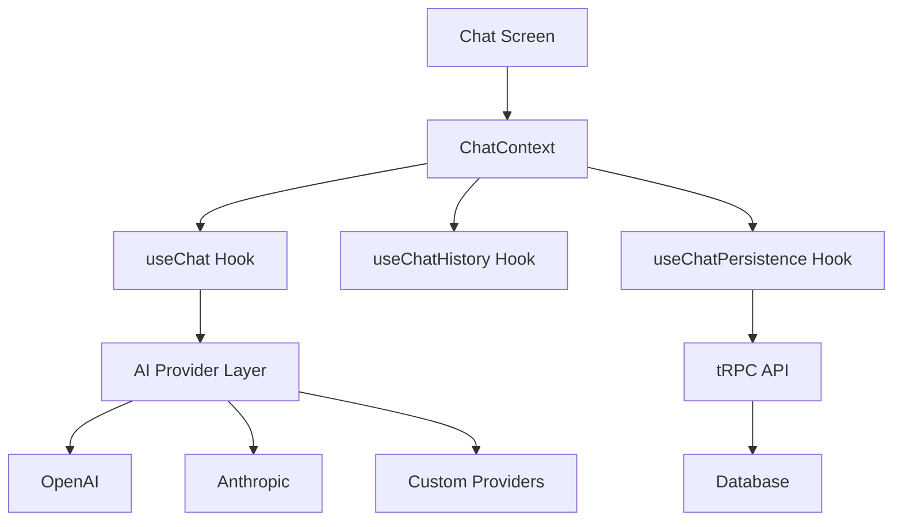

<Frame>
  
</Frame>

## Overview

Launch includes a production-ready AI chat feature with streaming responses and
chat history persistence. The architecture is modular, making it easy to extend
with additional providers and custom system prompts.

## Prerequisites

- Backend running with AI env vars set (copy from `apps/api/example.env` first)
- `EXPO_PUBLIC_API_URL` set in `apps/mobile/.env` (from `apps/mobile/example.env`)

<Tip>
  This feature is gated by the mobile feature registry flag: `ai`. See
  [Feature Registry](/mobile/feature-registry).
</Tip>

## Key Features

<Columns cols={2}>
  <Card title="Provider Abstraction" icon="brain">
    OpenAI is enabled by default. Anthropic support is wired in the backend and
    can be enabled in the mobile model list with a single config change.
  </Card>
  <Card title="Streaming Responses" icon="bolt">
    Real-time streaming for a responsive chat experience with stop generation
    support.
  </Card>
  <Card title="System Prompts" icon="wand-magic-sparkles">
    Predefined personas and custom system prompts to shape AI behavior.
  </Card>
  <Card title="Chat Persistence" icon="database">
    Conversation history stored in PostgreSQL via tRPC procedures.
  </Card>
</Columns>

## Architecture

The AI feature is built with extensibility in mind, separating concerns into distinct layers.



### Core Components

<Card title="AI Provider Abstraction" icon="layer-group">
  **Location**: `lib/ai/providers/` A unified interface for working with
  different AI providers. OpenAI is enabled by default; add Anthropic to the
  providers list to expose Claude models in the UI.
</Card>

<Card title="Custom Hooks" icon="code">
  **Location**: `features/chat/hooks/` Business logic extracted into reusable
  hooks: `useChat` for messaging, `useChatHistory` for history management, and
  `useChatPersistence` for database sync.
</Card>

<Card title="Chat Context" icon="share-nodes">
  **Location**: `features/chat/context/` Global state management for chat
  functionality, reducing prop drilling and simplifying component interactions.
</Card>

## Steps

1. Copy the example env (if not already):

```bash
cd apps/api
cp example.env .env
```

2. Add API keys to your backend `.env`:

```bash
# OpenAI (required for AI chat)
OPENAI_API_KEY=sk-...

# Anthropic (optional - enable in mobile model list)
ANTHROPIC_API_KEY=sk-ant-...
```

3. Ensure the AI feature flag is enabled:

`apps/mobile/features/feature-registry.tsx` → `featureFlags.ai = true`

4. (Optional) Enable Anthropic models in the mobile picker:

`apps/mobile/lib/ai/providers/index.ts` → add `anthropicProvider` to the
`providers` array.

5. Open the chat screen at `/ai-chat`.

## How It Works

- Mobile streams tokens from the API via `POST /api/ai/stream` (SSE)
- Chat history is persisted via tRPC procedures under `chat.*`
- System prompts are defined in `apps/mobile/lib/ai/prompts/index.ts`

## Key Files

- API streaming: `apps/api/src/routes/ai-stream.ts`
- AI providers: `apps/api/src/services/openai.ts` and `apps/api/src/services/anthropic.ts`
- Chat persistence: `apps/api/src/routers/chat.ts`
- Mobile streaming client: `apps/mobile/lib/api/streaming.ts`
- Chat UI and hooks: `apps/mobile/features/chat/`

## Customizing System Prompts

System prompts define the AI's persona and behavior:

```typescript
export const systemPrompts = {
  staffEngineerMentor: {
    id: "staff-engineer-mentor",
    name: "Staff Engineer Mentor",
    description: "A senior mentor who teaches through the Socratic method",
    prompt: `You are a senior staff software engineer with 20+ years...`,
  },
  codingAssistant: {
    id: "coding-assistant",
    name: "Coding Assistant",
    description: "A helpful coding assistant",
    prompt: `You are a helpful coding assistant...`,
  },
};
```

Conversations are persisted in Prisma under the `Chat` and `ChatMessage` models
in `apps/api/prisma/schema.prisma`.

## API Endpoints

The chat feature exposes the following tRPC procedures:

| Procedure          | Type     | Description                        |
| ------------------ | -------- | ---------------------------------- |
| `chat.list`        | Query    | Get all chats for the current user |
| `chat.get`         | Query    | Get a specific chat with messages  |
| `chat.create`      | Mutation | Create a new chat                  |
| `chat.delete`      | Mutation | Delete a chat                      |
| `chat.addMessage`  | Mutation | Add a message to a chat            |
| `chat.updateTitle` | Mutation | Update chat title                  |

## Test Checklist

- Chat screen loads and streams responses
- New chats are saved and appear in history
- Switching models updates the active provider

## Troubleshooting

If streaming fails, verify API keys and server logs. For general issues, start
with [Troubleshooting](/troubleshooting).

## Remove / Disable

To disable AI while you configure providers, set:

`apps/mobile/features/feature-registry.tsx` → `featureFlags.ai = false`

For production removal guidance, see [Removing Features](/essentials/removing-features).

## Next Steps

- [Feature Registry](/mobile/feature-registry)
- [Incident Debugging](/essentials/incident-debugging)


